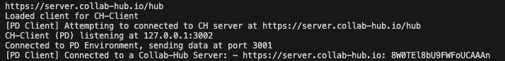
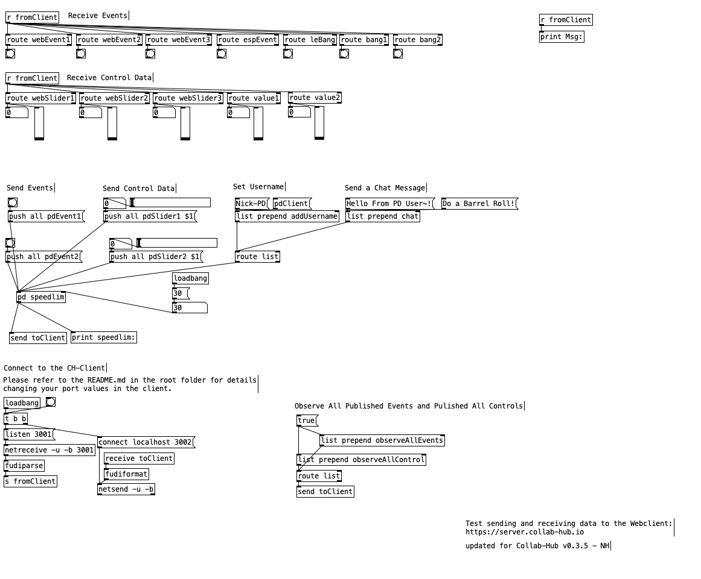

# Collab-Hub PD Client 0.3

<br/>

 &nbsp; &nbsp; 

<br/>

---
### NIME WORKSHOP
This version is used for the NIME 2021 Workshop. For the latest version of the PD-Client and more examples, please visit [https://github.com/Collab-Hub-io].

## Overview

The Collab-Hub Pd Client is a tool designed to faciliate communication with the Collab-Hub server from within [Pd](https://puredata.info). This client will help you send/receive data over the internet between Pd and/or other platforms.

The Pd Client package currently consists of (1) a PD example patch, (2) a node bundle. 

This Collab-Hub Pd Client package utilizes [Node.js](https://nodejs.org) and [Socket.IO](https://socket.io). 

Below shows how data follows between Collab-Hub, the client, and Pd:

*Pd <=> Collab-Hub Pd Client <=> Collab-Hub Server <=> Other Clients*

<br/>

---

## Getting Started

*An upcoming version of this client will be a standalone application, where you will not have to start node instances or install other applications.*

1. Download the Collab-Hub-Pd-Client folder using the green Code button near the top of this page. Either choose "Download ZIP" or, if you're comfortable using git, you can clone the repo.
2. Download and install Node.js from https://nodejs.org.
3. Download and install Pd from https://puredata.info.
4. Navigate to the downloaded Collab-Hub-Pd-Client package folder. If you downloaded the package as a ZIP, then unzip it, and naviagate to that folder.
5. From your operating system's Terminal/Command Prompt, <br/>
type ```node main.js``` -- this will start the Client using its default settings: 
   - connecting to ```ch-server.herokuapp.com```
   - using a receive port of ```3002``` (Pd will SEND to this port)
   - using a send port of ```3001``` (Pd will RECEIVE at this port)
7. From your Terminal/Command Prompt, you should a logged message of <br />
   ``` connected - https://ch-server.herokuapp.com: ```
   signifying your connection to the Collab-Hub client. You might see other messages as well. Keep this window open, as you will be able to see messages from the server as you send/receive data. See image below.
   
8. Open Pd-Example.pd
9. The patch should automatically try to connect to client. Check the PD window for errors.
10. You are now able to send and receive Events, Controls, and Chat with Collab-Hub.
    

DEMO VIDEO COMING SOON



<br/>

```
Further details on the node/javascript files coming soon
```
