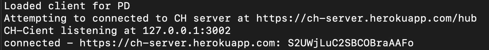
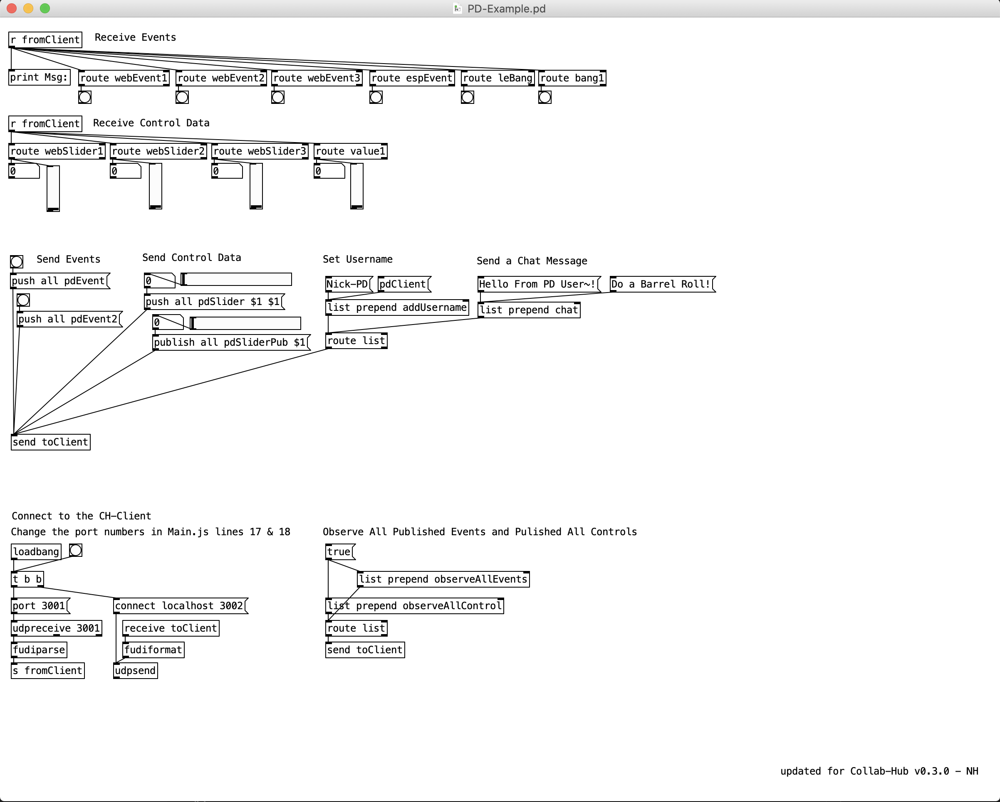

# Collab-Hub PD Client 0.3.6

#### Updated 12/31/25 - Nick

<br/>

 &nbsp; &nbsp; 

<br/>

---

## Overview

The Collab-Hub Pd Client is a tool designed to faciliate communication with the Collab-Hub server from within [Pd](https://puredata.info). This client will help you send/receive data over the internet between Pd and/or other platforms.

The Pd Client package currently consists of (1) a PD example patch, (2) a node bundle.

This Collab-Hub Pd Client package utilizes [Node.js](https://nodejs.org) and [Socket.IO](https://socket.io).

Below shows how data follows between Collab-Hub, the client, and Pd:

_Pd <=> Collab-Hub Pd Client <=> Collab-Hub Server <=> Other Clients_

<br/>

---

## Getting Started

_An upcoming version of this client will be a standalone application, where you will not have to start node instances or install other applications._

1. Download the Collab-Hub-Pd-Client folder using the green Code button near the top of this page. Either choose "Download ZIP" or, if you're comfortable using git, you can clone the repo.
2. Download and install Node.js from https://nodejs.org.
3. Download and install Pd from https://puredata.info.
4. Navigate to the downloaded Collab-Hub-Pd-Client package folder. If you downloaded the package as a ZIP, then unzip it, and naviagate to that folder.
5. Open `Pd-Example.pd` prior to connecting to the Collab-Hub Server.
6. We've simplified the process to get started. We have default send and receive port values. Follow steps below to use the default ports (PD receives at `3001`, send to `3002`). If you would like to customize those ports, skip to the next section.
7. From your operating system's Terminal/Command Prompt, <br/>
   type `npm run pd`. This will start the Client using its default settings:
   - connecting to `https://server.collab-hub.io`
   - using a receive port of `3002` (Pd will SEND to this port)
   - using a send port of `3001` (Pd will RECEIVE at this port)
8. From your Terminal/Command Prompt, you should see a logged message of <br />
   `connected - https://server.collab-hub.io:`
   signifying your connection to the Collab-Hub client. You might see other messages as well. Keep this window open, as you will be able to see messages from the server as you send/receive data. See image below.
   
9. The PD patch should automatically try to connect to client. Check the PD window for errors.
10. You are now able to send and receive Events, Controls, and Chat with Collab-Hub.
11. You can test sending and receiving values now. If you want to test using our Web Interface, go to https://server.collab-hub.io
12. `Webslider3` and `WebEvent3` using 'Push' mode, and any value changes on the web interface should arrive to the PD environment without extra actions.
13. Close the client connection with Ctrl+C in your Terminal/Command Prompt.

---

## Constructing your own messages

1. Messages are made of four main elements: `mode` `target` `header` `values`
1. An Event Messages just `mode` `target` `header`, so message to the server of `push all pdEvent1` has `push` as the mode, `all` as the target (everyone in the namespace), and `pdEvent1` as the header.
1. A Control Message has `mode` `target` `header` `value(s)`, so message to the server of `push all pdSlider1` has `push` as the mode, `all` as the target (everyone in the namespace), `pdSlider1` as the header and the slider value.

   

1. When receiving an events or controls, you construct your [route] object for the headers. You can include both event and control message headers in the same header.

   

---

## Customizing Client Setup

1. If you want to change the port values, instead of running `npm run pd`, use the following line replacing the `RECPORT ` and `SENDPORT` with your port values:
2. `npm main.js -e pd -r RECPORT -s SENDPORT`
3. You should see a similar ackowledgement that the Client running the CH-PD library at the ports you supplied is connect (see image below):
   

DEMO VIDEO COMING SOON



<br/>

```
Further details on the node/javascript files coming soon
```

### Questions?

- Email Nick at nickthwang at gmail

---

## Changelog

- #0.3.6

  - Moved Default Server to http://server.collab-hub.io, was previously https://ch-server.herokuapp.com
  - Anticipating 0.4.0 release of localized servers for RaspberryPis.
  - Moved Web Interface to http://server.collab-hub.io, should look different
